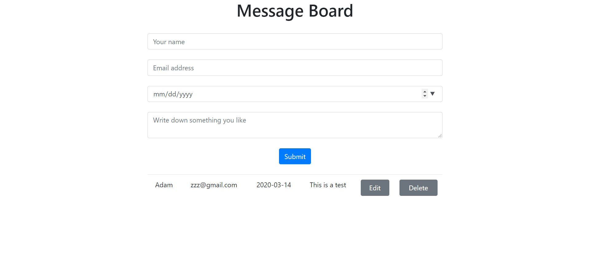

This project was bootstrapped with [Create React App](https://github.com/facebook/create-react-app).

# Message Board
Message Board is a simple and effective react-redux web application that allows visitors to write down their words online and save it

## Preview


## Installation
- Clone the repo in your terminal by clicking the _green_ clone or download button at the top right and copyin the url
- In your terminal, type  ```git clone URL```
  - Replace URL with the url you copied
  - Hit 'Enter'
- This will copy all the files from this repo down to your computer
- In your terminal, cd into the directory you just created
- Type ```npm install``` to install all dependencies
- Last but not least, type ```npm start``` to run the app locally.

- To look at the code, just open up the project in your favorite code editor!
